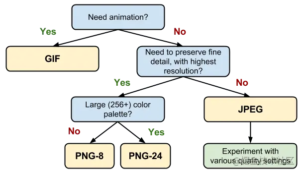

### 本地图片优化
常见的几种图片格式有：jpg|jpeg、png、gif、webp。其中，webp 图片是由 Google 开发的一种新的图片格式，相比其他格式的图片，有更好的压缩效果，被设计来取代其他格式。同一张图片，使用 webp 格式，相对于其他格式可以减少 25% 到 30% 的体积，这减小了页面大小并提高了性能。



需要注意的是，webp 存在一定的[兼容性](https://caniuse.com/?search=webp)问题。针对不兼容 webp 的浏览器，可以将原图进行一定比例的压缩，生成小图。在一定比例的压缩下，小图和原图视觉效果并没有区别。

在本地图片资源比较多的项目中，图片优化能带来比较大的性能收益。

#### 实现方案
通过脚本遍历项目内的图片资源，将 jpg、jpeg、png、gif 格式的图片生成对应的 webp 格式图片。将 jpg、jpeg、png 格式的图片生成原图的压缩图，文件名以 -m 结尾。

支持 webp 格式的浏览器加载 webp，不支持的加载 -m 压缩图。

需要禁用图片内联(webpack 设置 `inlineLimit = 0`)，否则小图会被转成 base64 内联到 css 里。

**注意，有些 jpg|jpeg|png|gif 图片本身经过优化，转 webp 后反而文件更大，对于这种文件，就不需要做转换。请根据实际项目的情况判断。目前使用该方案的项目中，图片都没有经过优化，所以通过这个方案进行优化后，效果显著。原图有 92M 左右，经过压缩后，webp格式的图片总大小为 12.18M，减少 87%；小图的总大小为 54.25M，减少 43%。**

**gif 本身就压缩过，再压缩大多数时候就是抽帧，目测压缩效果不好，因此暂不考虑。有兴趣的可以使用 [imagemin-gifsicle](https://github.com/imagemin/imagemin-gifsicle) 试试。**

#### 实现步骤
1. 脚本生成不同格式的图片
2. 判断当前浏览器是否支持 webp 格式，针对不同的兼容性做处理，需要同时处理 js 和 css 两部分的内容
3. 抽象图片组件、背景图样式，统一处理图片引入

#### 关键代码
##### 生成图片
```js
async function handleFile(sourcePath) {
  const webpFileName = sourcePath.replace(/\.\w+/, '.webp');
  const minFileName = sourcePath.replace(/(\.\w+)/, '-m$1');
  const webpFileExist = existsSync(webpFileName);
  const minFileExist = existsSync(minFileName);
  const ext = getExtension(sourcePath);
  const info = {
    origin: sourcePath,
    webp: webpFileName,
    min: {
      file: minFileName,
      generate: ext !== 'gif', // gif 不生成原图压缩
    },
  };
  let data;
  if (!webpFileExist || !minFileExist) {
    data = await readFile(sourcePath);
  }
  if (!webpFileExist) {
    if (ext === 'git') {
      const gifData = await imageminGif2webp({
        quality: 85,
      })(data);
      await writeFile(webpFileName, gifData);
    } else {
      const webpData = await imageminWebp({
        quality: 85,
      })(data);
      await writeFile(webpFileName, webpData);
    }
  }
  if (!minFileExist) {
    if (ext === 'png') {
      const pngData = await imageminPngquant({
        quality: [0.65, 0.8],
      })(data);
      await writeFile(minFileName, pngData);
    } else if (ext !== 'gif') {
      const jpgData = await imageminMozjpeg({
        quality: 70,
      })(data);
      await writeFile(minFileName, jpgData);
    }
  }
  print(info);
}
```
##### 判断是否支持 webp
```js
const isSupportWebp = function () {
  try {
    return (
      document
        .createElement('canvas')
        .toDataURL('image/webp', 0.5)
        .indexOf('data:image/webp') === 0
    );
  } catch (err) {
    return false;
  }
};
```
##### 图片引入
图片引入需要考虑两种情况：
1. 在 jsx|tsx 里引入
2. 在 css 里引入

针对在 jsx|tsx 里引入的情况，利用 webpack 的 `require.context` 实现一个图片引入函数

```js
/**
 *
 * @param {*} src 图片资源路径，必须使用绝对路径 例如 @/asset/img/a.png
 * @returns img module
 */
export function importImg(src) {
  const srcArr = src.split('/');
  const suffix = srcArr.pop();
  const isGif = /\.gif$/.test(suffix); // gif 不压缩
  const name = `${suffix.replace(/\.\w+$/, '')}${useWebp || isGif ? '' : '-m'}`;
  const pathArr = `${srcArr.join('/')}`.split('/');

  const importImage = (r) => {
    const matchKey = r.keys().filter((key) => {
      const arr = key
        .replace(/\.\//, '')
        .replace(/\.\w+$/, '')
        .split('/');
      const itemName = arr.pop();
      const srcPath = pathArr.slice(pathArr.length - arr.length).join('/');
      const itemPath = arr.join('/');
      if (itemName === name && srcPath === itemPath) {
        return true;
      }
      return false;
    })[0];
    // matchKey 是相对于 src 的相对路径
    return r(matchKey);
  };

  const getContext = () => {
    if (useWebp) {
      return require.context('/src', true, new RegExp('\\.webp$'));
    } else if (isGif) {
      return require.context('/src', true, new RegExp('\\.gif$'));
    } else {
      return require.context('/src', true, new RegExp('-[m]{1}\\.\\w+$'));
    }
  };

  const image = importImage(getContext());
  return image;
}
```

封装一个 `Image` 组件，替代原生的 `img` 标签

```jsx
import React from 'react';
import { importImg } from '@/util/img';

function Image({ src }) {
  return ;
}

export default Image;
```

通过以下方式引入图片
```jsx
import Image from '@/component/Image'

// 注意，这里必须使用绝对路径
const src = '@/asset/img/arrow.png'

export function Img() {
  return (
    <>
      <Image src={src}>
      <div
        style={{
          backgroundImage: `url(${importImg(src)})`
        }}
      >
    </>
  )
}
```

针对在 css 中引入图片的情况，首先需要根据是否支持 webp ，在 DOM 的顶层添加一个样式：

```jsx
  <div className={`${useWebp ? 'webp' : ''}`}>
```

然后需要编写一个 postcss 插件实现图片路径转换：
```js
// PS: 使用 umi 生成项目，由于 umi 内置支持 postcss@7 因此以 postcss@7 的 api 来实现插件
const postcss = require('postcss');

const backgroundReg = /^background(-image)?$/;
const wrapperClass = 'webp';
const ImageReg = /\.(gif|png|jpe?g)/;
const StaticImageReg = /(\.png|\.jpe?g)/;

module.exports = postcss.plugin('postcss-reverse-props', (options = {}) => {
  return (root) => {
    root.walkRules((rule) => {
      if (rule.selector.indexOf(`.${wrapperClass}`) !== -1) {
        return;
      }
      const backgroundImage = rule.nodes.filter(
        (el) => el.type === 'decl' && el.prop.match(backgroundReg),
      );
      if (backgroundImage && backgroundImage.length) {
        rule.walkDecls(backgroundReg, (decl) => {
          const hasUrl = decl.value.match(/url\((.*)?\)/);
          if (hasUrl) {
            const imageUrl = hasUrl[1].replace(/'|"/gi, '');
            if (
              imageUrl.indexOf('.webp') !== -1 ||
              imageUrl.startsWith('data:image')
            ) {
              return;
            }
            const webpImageUrl = imageUrl.replace(ImageReg, '.webp');
            const webpRule = postcss.rule({
              selector: `:global(.${wrapperClass}) ${rule.selector}`,
            });
            webpRule.append({
              prop: 'background-image',
              value: `url(${webpImageUrl})`,
              important: decl.important,
            });
            rule.parent.append(webpRule);
            decl.value = decl.value.replace(StaticImageReg, '-m$1');
          }
        });
      }
    });
  };
});
```

引入这个插件后，在 css 中引入的图片将会根据是否支持 webp 来匹配合适的资源。

```css
  background-image: url('../asset/one.png');
  // 支持 webp，引入 `one.webp`
  // 不支持 webp，引入 `one-m.png`
```

#### 备注
除了上述的构建方案，webpack 还提供了一个插件 [ImageMinimizerWebpackPlugin](https://webpack.docschina.org/plugins/image-minimizer-webpack-plugin/)，用于在构建时进行图片优化。

#### 参考
* [代码示例 perf-img](https://github.com/gyh9457/perf-img)
* [Use Webp Image](https://web.dev/serve-images-webp/)