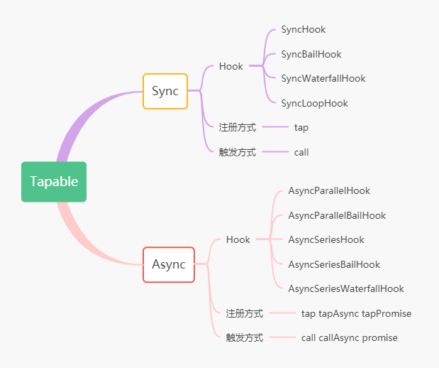

### Tapable
**基于 Tapable@1.1.3**

`Tapable` 提供了很多的钩子类，这些类可以为插件创建钩子。



#### 钩子类别
分为同步和异步，异步中分为异步串行和异步并行

1. Sync
2. AsyncSeries
3. AsyncParallel

根据钩子类型，可以分为 `basic` `bail` `waterfall` `loop`
* 基本的钩子，(钩子类名没有 waterfall、Bail、或者 Loop 的)，这个钩子只会简单的调用每个 tap 进去的函数
* Waterfall, 一个 waterfall 钩子，也会调用每个 tap 进去的函数，不同的是，它会从每一个函数传一个返回的值到下一个函数
* Bail, bail 钩子允许更早的退出，当任何一个 tap 进去的函数，返回值不为 undefined，bail 钩子会停止执行其他的函数
* Loop，当 tap 进去的函数返回值不为 undefined 时循环执行这个函数，直到返回 undefined

#### 基本用法
```js
  const { SyncHook } = require('tapable')

  const hook = new SyncHook(['name'])
  hook.tap('a', (name) => {
    console.log(name)
  })

  hook.call('gyh')
```

#### 参考
[官网文档](https://github.com/webpack/tapable)

[编写自定义webpack插件从理解Tapable开始](https://juejin.im/post/5dcba29f6fb9a04abb01fd77#heading-12)

[webpack4.0源码分析之Tapable](https://juejin.im/post/5abf33f16fb9a028e46ec352)

[webpack系列之二Tapable](https://juejin.im/post/5c25f920e51d45593b4bc719#heading-0)

[这才是官方的tapable中文文档](https://segmentfault.com/a/1190000017420937)

[不满足于只会使用系列: tapable](https://segmentfault.com/a/1190000017421077)